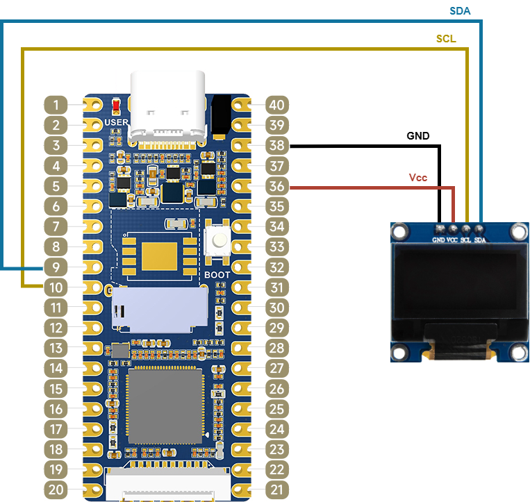

# I2C OLED display driver

[I2C (Inter-Integrated Circuit)](https://en.wikipedia.org/wiki/I%C2%B2C) is a synchronous serial communication bus which allows for multiple digital circuits to communicate.
It is master-slave oriented protocol, realized with two physical lines required for the communication (excluding Ground): SDA (data line) and SCL (clock line).
Each slave has address, which the master utilizes to initiate communication with that specific slave.

In this exercise, kernel module will be created for [SSD1306](https://www.solomon-systech.com/product/ssd1306/) based OLED display module with resolution 128x64, which will create char device that allows interfacing with the display in user-space.

Few things will be covered, including:
- I2C device interfacing in kernel
- Creating kernel module
- Creating char device

## Connection diagram

- pin 9 Luckfox Pico board -> SDA pin display
- pin 10 Lucfox Pico board -> SCL pin display
- pin 36 Luckfox Pico board -> 3V3(OUT) pin display
- pin 38 Luckfox Pico board -> GND pin display



## Configuring I2C3 using `luckfox-config`

1. Launch `luckfox-config` utility on the luckfox pico board.
2. Select `Advanced Options`
3. Select `I2C`
4. Select `I2C3_M1`

After that, the I2C3 module can be used.
It should appear in `/sys/class/i2c-dev` as `i2c-3`.

## Creating kernel module

Linux kernel modules are object files that contain code that can extern the kernel functionalities during runtime.
The concept of kernel modules add some modularity and extensibility to monolithic kernel operating systems, like Linux.
The kernel modules can be loaded when needed and unloaded when not needed.

In Linux, the kernel modules have the extension `.ko`.
Every module has two main functions:
- module `init` function, called when the module is loaded, and
- module `exit` function, called when the module is unloaded.
Besides these two functions, every module contains info regarding module's author, description and license.

The simplest code for creating kernel module is given below:

```c
#include <linux/init.h>
#include <linux/module.h>
#include <linux/printk.h>
 
MODULE_LICENSE("GPL"); 
MODULE_AUTHOR("Author"); 
MODULE_DESCRIPTION("Sample module"); 
 
static int __init sample_module_init(void) 
{ 
    pr_info("Loaded sample module\n"); 
    return 0; 
} 
 
static void __exit sample_module_exit(void) 
{ 
    pr_info("Unloaded sample module\n"); 
} 
 
module_init(sample_module_init); 
module_exit(sample_module_exit);

```

Building of the kernel module can be performed with the following `Makefile` (targeting the luckfox-pico board):

```makefile
obj-m += sample_module.o

KDIR := ../../sysdrv/source/objs_kernel # path is found under luckfox-pico SDK root

all:
	make ARCH=arm CROSS_COMPILE=arm-rockchip830-linux-uclibcgnueabihf- -C $(KDIR) M=$(PWD) modules
clean:
	rm -f *.ko *.o *.mod *.mod.o *.mod.c *.symvers *.order

```

To build modules for the luckfox pico board, ensure that you at least once build an image, so the directory `objs_kernel` exists.

The kernel modules can be loaded in the kernel using `insmod`, while unloaded using `rmmod`:
```shell
insmod sample_module.ko # loads sample_module
rmmod sample_module.ko # unloads sample_module
```

## I2C device interfacing in kernel

The Linux kernel provides two main abstractions for interfacing with I2C devices.
First, there is the I2C adapter driver, which abstracts the I2C bus hardware, for example I2C-3 module on the luckfox pico board.
The adapter is represented with `struct i2c_adapter`.
Then, there is concept of I2C clients, which are actually the devices connected on the specific I2C bus, represented with `struct i2c_client`.
Each I2C client contains the actual I2C device driver, represented with `struct i2c_driver`, containing functions that should be called when the driver is inserted and removed from the kernel.

In this example, the I2C-3 module is binded to an I2C adapter, which we use to create the I2C client for the display module.
The I2C driver contins functions that will initialize the display when the kernel module is loaded and turn-off the display when the kernel module is removed.

The [kernel docs](https://docs.kernel.org/i2c/writing-clients.html) provide explanation how to add I2C device driver.
In summary, the steps for adding the I2C device driver are:

1. Create `i2c_driver` instance for the driver, for example:
```c
#include <linux/i2c.h>
#include <linux/i2c-dev.h>

static int ssd1306_probe(struct i2c_client *client, const struct i2c_device_id *id) {
    // code for initializing the display module
}

static int ssd1306_remove(struct i2c_client *client) {
    // code for turning off display
}

static struct i2c_device_id ssd1306_idtable[] = {{CLIENT_NAME, 0}, {}};

static struct i2c_driver ssd1306_i2c_driver = {
    .driver = {.name = CLIENT_NAME, .owner = THIS_MODULE},
    .id_table = ssd1306_idtable,
    .probe = ssd1306_probe,
    .remove = ssd1306_remove,
};
```
2. Obtain `i2c_adapter` instance, by calling `ssd1306_i2cAdapter = i2c_get_adapter(bus_number)`, where `bus_number = 3` in our case, as we use `I2C-3` device.
3. Create `i2c_client`, by utilizing the adapter and using instance of `i2c_board_info`, which contains the address of the slave device. The client is used for performing the I2C transactions.
```c
static struct i2c_board_info ssd1306_i2cBoardInfo = {
    I2C_BOARD_INFO(CLIENT_NAME, SSD1306_I2C_ADDR)};
ssd1306_i2cClient = i2c_new_client_device(ssd1306_i2cAdapter, &ssd1306_i2cBoardInfo);
```
4. Add the `i2c_driver` instance:
```c
i2c_add_driver(&ssd1306_i2c_driver);
```
5. Release the `i2c_adapter`:
```c
i2c_put_adapter(ssd1306_i2cAdapter);
```

The code for SSD1306 driver is mainly platform-independent and only requires `i2cWrite` function to be specified.
In our case, that function can be implemented by utilizing the client, i.e.
```c
static int ssd1306_i2cWrite(const unsigned char *data, const unsigned char size) {
  return i2c_master_send(ssd1306_i2cClient, data, size);
}
```

## Creating char device

One of the simplest ways to interact with kernel modules is by utilizing char devices.
Character devices are devices that allow to access hardware devices in stream-oriented byte operations.
They are mapped in `/dev` directory and implement the file operations, like open, close, read and write in a way to allow the user-space to communicate with the device.

Each char number has major and minor numbers.
The major number identifies the driver, while the minor number identifies instance of device managed by the driver.

Creating char device consists of multiple steps, presented below, with references to the actual display driver code:

1. Allocating range of char device numbers
```c
static dev_t ssd1306_dev_id;
alloc_chrdev_region(&ssd1306_dev_id, 0, 1, DRIVER_NAME);
```

2. Creating device class for `sysfs` integration:
```c
static struct class *ssd1306_class = NULL;
ssd1306_class = class_create(THIS_MODULE, DRIVER_CLASS);
```

3. Creating device file, in `/dev` directory, to allow user-space access to the device:
```c
device_create(ssd1306_class, NULL, ssd1306_dev_id, NULL, DRIVER_NAME);
```

4. Initializing and adding of character device. This step requires to specify the actions done when performing file operations on the device.
```c
#define CHAR_DEV_BUFFER_SIZE 256
static unsigned char ssd1306_char_dev_buffer[CHAR_DEV_BUFFER_SIZE];

static int ssd1306_char_open(struct inode *inode, struct file *file) {
    // perform action when opening the char dev file
}
static ssize_t ssd1306_char_write(struct file *file, const char __user *buffer, size_t count, loff_t *ppos) {
    // copy the data from user-space to kernel buffer
    copy_from_user(ssd1306_char_dev_buffer, buffer, count);
    // utilize the data to perform operation, i.e. writing to display
}
static int ssd1306_char_release(struct inode *inode, struct file *file) {
    // perform action when closing the char dev file
}
static const struct file_operations ssd1306_char_fops = {
    .owner = THIS_MODULE,
    .open = ssd1306_char_open,
    .release = ssd1306_char_release,
    .read = NULL,
    .write = ssd1306_char_write,
};

static struct cdev ssd1306_cdev;
cdev_init(&ssd1306_cdev, &ssd1306_char_fops);
cdev_add(&ssd1306_cdev, ssd1306_dev_id, 1);
```

When performing operations on the character device file in the kernel module, remember to copy the user-space buffer to kernel-space and the other way around for write and read operations, accordingly.

## Code

The code for this example can be found under `user_apps/ssd1306_driver`, which builds the `ssd1306_drv.ko` kernel module driver.
The main kernel driver code can be found in `ssd1306_driver.c`, while the `ssd1306.h`, `ssd1306.c`, and `ssd1306_font.c` are the platform-independent SSD1306 OLED display controller driver code.
Copy the driver module to the luckfox pico board, and execute `insmod ssd1306_drv.ko`.
The display module should display `SSD1306 OLED` in the first line, and have filled second line if the initialization is successful and the module is loaded.
One can also check `dmesg` for log saying `SSD1306 driver is added`.

To interface with the display, one can use the `/dev/ssd1306_disp` character device.
The device accepts ASCII strings and after each output to this device, the cursor is moved on the next line.
For example, to print the string `Hello World` on the display, execute `printf "Hello World" > /dev/ssd1306_disp`.
To clear the device, send `NULL` character, i.e. `printf "\0" > /dev/ssd1306_disp`.
No text wrapping or other special characters interpretation is handled.

Refer to the example for more deatils.
