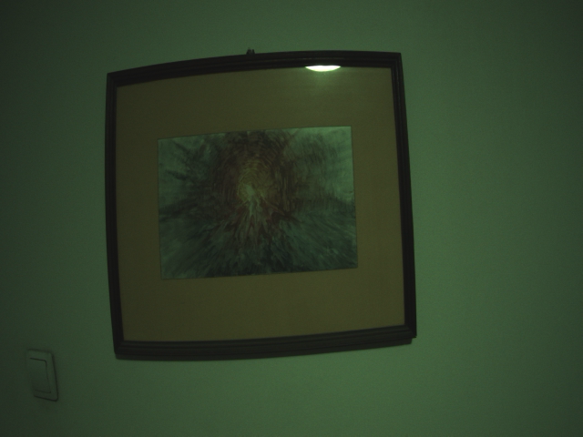
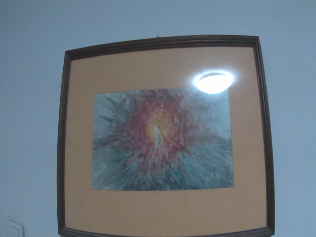

# Camera interface

In this page, we are going to explore how to capture images and videos with CSI camera connected to the Luckfox Pico board, with some already-provided tools, but also with custom program in C.

## Camera intro

The buildroot image that was built for the Luckfox Pico board already has everything that is needed to interface with the camera.
The image runs example program called `rkipc`, which executes automatically after boot-up and creates RTSP stream which can be used to view the camera feed.

The Luckfox [doc pages](https://wiki.luckfox.com/Luckfox-Pico/CSI-Camera/) provide basic introduction to utilizing the camera on the board.
The camera feed can be viewed by playing the RTSP stream, using VLC player for example, by providing corresponding IP address, which in our case should be `rtsp://172.32.0.93/live/0`.
Change VLC caching to 300 ms to improve latency.

## Video4Linux

### Capturing videos with V4L

[Video4Linux](https://www.kernel.org/doc/html/v4.12/media/v4l-drivers/index.html) which is a collection of device drivers and APIs for real-time video capture on Linux.
Video4Linux(V4L) is responsible for creating V4L2 device nodes (i.e. `/dev/video0`), configuring them and requesting data from them.

There are few `/dev/videoN` char devices, of which most interesting are:
1. `/dev/video0`, which is device to access raw camera data ([Bayer data](https://en.wikipedia.org/wiki/Bayer_filter))
2. `/dev/video11`, which is device used to access data processed by the hardware ISP, which color representation is in [YUV format](https://en.wikipedia.org/wiki/Y%E2%80%B2UV).

V4L has multiple utility programs that can be used to check info about devices, query their capabilites, set parameters and capture videos and images.
The main tool providing access to V4L drivers is `v4l2-ctl`.
Common options to use this tool are:
1. List devices, with `v4l2-ctl --list-devices`.
2. Check the current video format (resolution, pixel format, image size, etc.) of a specific device using `v4l2-ctl -d /dev/videoN --get-fmt-video`.
3. List supported formats and resolutions for a given device using `v4l2-ctl -d /dev/videoN --list-formats-ext`.
4. Record video from device video11, with resolution 640x480 and pixel format NV12, until user sends interrupt signal: `v4l2-ctl --device=/dev/video11 --set-fmt-video=width=640,height=480,pixelformat=NV12 --stream-mmap --stream-to=/userdata/video.yuv`
5. Capture single image from device video11, with resolutiion 1920x1080, pixel format NV12 with: `v4l2-ctl --device=/dev/video11 --set-fmt-video=width=1920,height=1080,pixelformat=NV12 --stream-mmap --stream-to=/userdata/photo.yuv --stream-count=1`

To play the captured YUV videos or preview YUV images, we can use `ffplay` from [`FFMPEG`](https://www.ffmpeg.org/).
FFMPEG is a complete cross-platform solution to record, convert and stream audio and video.

To play the `NV12` pixel format videos we can use the following command on the host PC (note that the raw YUV video does not contain any metadata, such as frame rate or similar things, so the framerate specified is not the real one):
```
ffplay -video_size 640x480 -pixel_format nv12 -framerate 25 -i video.yuv
```
### Capturing images in C using V4L

Camera devices are more complicated and it is not possible to capture images by simply reading from the device file, i.e. reading from `/dev/video0`.
Instead, Video4Linux.

Video4Linux has C API that can be used to capture images from camera.
The main idea can be described with the following steps:

1. Query device capabilities - ensure that the device is video capture device and supports the mode we are interested in
2. Set image format - set the image format for the captured frames, including resolution and pixel format
3. Request buffers - allocate buffers for the captured frames
4. Query buffers - query the information of the requested buffers to memory-map them in our application memory
5. Queue buffers - queue buffers for storing the captured frames
6. Start streaming - start frame capture
7. Dequeue buffers - dequeue buffers which contain captured frames
8. Stop streaming - stop frame capture

To check the supported image formats for the device, `v4l2-ctl` can be used, i.e.:

```
$ v4l2-ctl -d /dev/video0 --list-formats-ext

ioctl: VIDIOC_ENUM_FMT
        Type: Video Capture Multiplanar

        [0]: 'RG10' (10-bit Bayer RGRG/GBGB)
                Size: Stepwise 64x64 - 2304x1296 with step 8/8
        [1]: 'BA10' (10-bit Bayer GRGR/BGBG)
                Size: Stepwise 64x64 - 2304x1296 with step 8/8
        [2]: 'GB10' (10-bit Bayer GBGB/RGRG)
                Size: Stepwise 64x64 - 2304x1296 with step 8/8
        [3]: 'BG10' (10-bit Bayer BGBG/GRGR)
                Size: Stepwise 64x64 - 2304x1296 with step 8/8
        [4]: 'Y10 ' (10-bit Greyscale)
                Size: Stepwise 64x64 - 2304x1296 with step 8/8

```

The Luckfox Pico board has the raw camera data (Bayer image) accessible via `/dev/video0`.
The SoC on the board has Image Signal Processing block (ISP), which performs the necessary steps to read the raw camera data and apply image processing techniques on it, such as debayering, and the output image is accessible via char device `/dev/video11`.
The multi-planar V4L2 APIs should be used for the Luckfox Pico connected camera.

The example program can be found under `user_apps/cam_capture`.
Refer to it for more details and implementation of the steps mentioned above.
The output file is called `frame.raw` which can be transferred on host PC for previewing, after transforming it into appropriate format.

### Previewing captured images

The captured images have 640 x 480 resolution and pixel format NV12, which is YUV 4:2:0 format in which 12 bits per pixel are used, 6 for the chroma (Y-channel) and 6 for the weaved U and V channels.
In order to preview the image, we need to convert it to RGB format, which can easily be done in Python.
Check the script `nv12_to_rgb.py` in the same directory as the example program.



### Disadvantages of using V4L2 with the Luckfox Pico board

If we preview the images captured with V4L2 (with CLI tools or the example C program), have green tint.
The image quality of the `rkipc` demo looks much better.
The main reason for this is that the images captured with V4L2 are missing some of the image-processing functions which the `rkipc` demo applies, such as white-balance.

## Using `RKMPI`

To obtain better images with CSI camera, we can refer to the samples provided in the Luckfox Pico SDK, whose source code is found under `media/samples`, which utilzie RKMPI.
RKMPI stands for Rockchip Media Process Interface, which is a library that allows to capture images, while applying image processing functions optimized for Rockchip's chips.
More details regarding RKMPI can be found on [Luckfox Pico doc pages](https://wiki.luckfox.com/Luckfox-Pico/RKMPI-example/).

The compiled programs can be found on the image, in `/oem/usr/bin` directory.

One simple example that utilizes the image processing functionalities is `sample_vi`.
Simple usage of this example app: `sample_vi -w 1920 -h 1080 -a /etc/iqfiles/ -l 20 -o /data/`
With this example, `/dev/video12` device is used, which will be configured with resolution 1920x1080 (arguments `-w` and `-h`).
The files stored in the `/etc/iqfiles` directory (argument `-a`) are utilized for information regarding the Rockhip Auto Quality (rkaiq) module, which basically does the image processing.
We specify that we want to capture 20 images (`-l`) argument, and the output will be stored under `/data` directory, with default name of `vi_0.bin`.

After collecting the images, we can rename the file to `video.yuv` and use `ffplay` to replay it.
We can see that the first few frames are with low exposure, but the following ones are with good image quality, much better compared to V4L methods.



## Resources

- [Capture an image with V4L2](https://www.marcusfolkesson.se/blog/capture-a-picture-with-v4l2/)
- [Video4Linux kernel docs](https://www.kernel.org/doc/html/v4.12/media/v4l-drivers/index.html)
