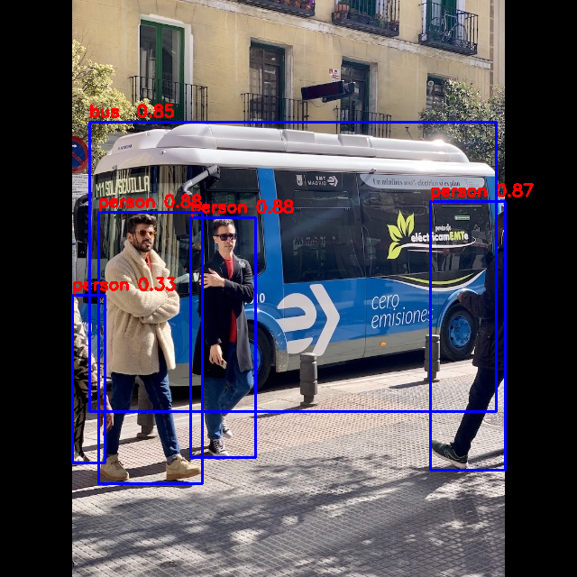
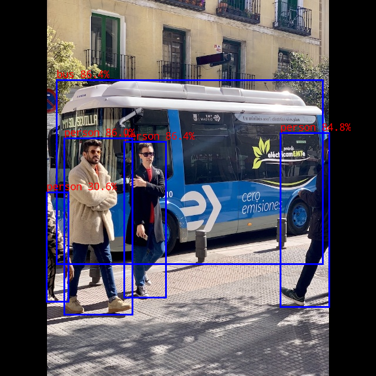

# Object detection

The final example of the tour with Luckfox Pico board is performing object detection on images captured with camera in real-time and providing RTSP stream with the modified image, showing bounding boxes around the objects.

## RKNN

The RV1103 chip on the Luckfox Pico board has Neural Processing Unit (NPU), which is a specialized processor designed to accelerate neural network computations.
Rockchip, the chip manufacturer calls this NPU RKNPU.

Rockchip provides software stack called RKNN which can be utilized to quickly deploy AI models to Rockchip chips.
The [Luckfox Pico docs](https://wiki.luckfox.com/Luckfox-Pico/Luckfox-Pico-RV1103/Luckfox-Pico-Plus-Mini/Luckfox-Pico-RKNN-Test/#62-compilation-and-building) provide info on RKNN.

This repository provides scripts for converting models to format ready for deployment on the Rockchip chip.
Clone this repository.
After clonning, we need to prepare Python environment that contains all required dependencies for running the conversion scripts.

To prepare the environment, we can perform the following steps:
1. Install [miniconda](https://docs.anaconda.com/miniconda/)
2. Create new conda environment, i.e. `conda create -n rknn python=3.11`
3. Activate the environment, i.e. `conda activate rknn`
4. Install the rknn-toolkit dependencies, i.e. `pip install -r rknn-toolkit2/packages/x86_64/requirements_cp311-2.3.0.txt`
5. Install the rknn-toolkit Python package, i.e. `pip install -r rknn-toolkit2/package/x86_64/rknn-toolkit2/packages/x86_64/rknn_toolkit2-2.3.0-cp311-cp311-manylinux_2_17_x86_64.manylinux2014_x86_64.whl`

To check that everything works fine, try running the following command and check that it executes successfully:
```
python -c "from rknn.api import RKNN"
```

### Preparing YOLO8 model

For this project, we are going to utilize [YOLO8](https://yolov8.com/) object detection model, which is already provided in the [RKNN model zoo](https://github.com/airockchip/rknn_model_zoo).
The model zoo provides deployment for mainstream neural network algorithms, such as YOLO8.

Clone the model zoo repository in our workspace.

#### 1. Downloading the ONNX model

There are already pre-trained versions of YOLO8 provided by rockchip in [ONNX](https://onnx.ai/) format.
The ONNX format is an open source format for representing AI models, such as deep neural networks.

To download the YOLO8 ONNX model, execute `download_model.sh` script under `rknn_model_zoo/examples/yolov8/model` directory.

To try the ONNX model:
1. Activate the `rknn` conda environment
2. Switch to `rknn_model_zoo/examples/yolov8/python` directory
3. Run `python yolov8.py --model_path ../model/yolov8n.onnx --img_show`. Pop-up window with detected objects on sample image will show up.



#### 2. Converting the ONNX model to RKNN format

To deploy the model to the Rockchip chip, we need to convert it from ONNX format to RKNN format.
To convert the model:
1. Activate the `rknn` conda environment
2. Switch to `rknn_model_zoo/examples/yolov8/python` directory
3. Run `python convert.py ../model/yolov8n.onnx rv1103 i8 ../model/yolov8n.rknn`

#### 3. Build RKNN C demo program

After we have the converted model, we can build demo C program, that allows to run inference on the Luckfox Pico board on given images.
To build this program:
1. Export the `GCC_COMPILER` shell variable: `export GCC_COMPILER=arm-rockchip830-linux-uclibcgnueabihf`
2. Execute `./build-linux.sh -t rv1103 -a armhf -d yolov8`.

After these steps, under the `rknn_model_zoo/install/rv1106_linux_armhf/rknn_yolov8_demo` directory we have all the files necessary to run inference on the Luckfox Pico board, along with test images.
We can copy these files to the board and proceed to testing the demo program.

#### 4. Running the demo program

After copying the demo program to the Luckfox Pico board, go to its directory and execute `./rknn_yolov8_demo model/yolov8n.rknn model/bus.jpg`.
The output image is stored under same directory, with name `out.png`.



The performance between ONNX and RKNN models are very similar on the same test image.
