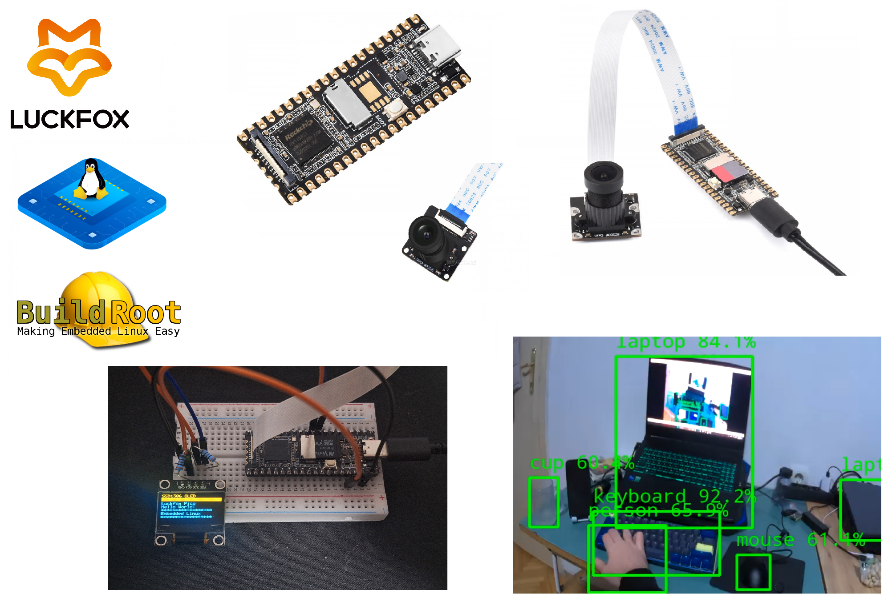

# Embedded Linux using LuckFox Pico

The goal of this project is to explore Embedded Linux using [Luckfox Pico](https://www.luckfox.com/Luckfox-Pico/EN-Luckfox-Pico) board.
Things that are going to be covered include: create bootable SD card, preparing dev environment, interfacing external devices, like displays, sensors, cameras and example with computer vision models.

## Required hardware

- Luckfox Pico board
- MicroSD card
- SSD1306 128x64 OLED
- SC3336 3MP Camera (A) module
- Resistors
- LEDs
- Jumper wires
- Breadboard

## Content

### [1. Getting started](01_GetStarted.md)

### [2. Preparing dev environment](02_DevEnv.md)

### [3. Interfacing GPIOs](03_GPIO.md)

### [4. I2C OLED display driver](04_I2cOledDriver.md)

### [5. Camera interface](05_CamInterface.md)

### [6. Project: Object detection](06_ObjDetection.md)
